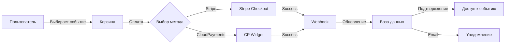

# Nethall Platform - Архитектура и Техническая Спецификация

## 📋 Обзор проекта

**Nethall** - современная платформа для проведения онлайн-мероприятий, мастер-классов и конференций с встроенной системой оплаты, расписанием и видеотрансляциями.

### Целевая аудитория
- **Организаторы**: Коучи, преподаватели, эксперты
- **Участники**: Ученики, слушатели
- **Бизнес**: Университеты, школы, компании

---

## 🎯 Ключевые функции

### Для организаторов
- Создание публичных/приватных групп
- Планирование и проведение видеотрансляций
- Управление участниками и правами доступа
- Встроенный кошелек с быстрым выводом средств
- Статистика и аналитика
- Интеграция с CRM
- Продвижение через хештеги

### Для участников
- Поиск групп по интересам
- Быстрая регистрация на мероприятия
- Календарь с напоминаниями (учет часовых поясов)
- Донаты и благодарности экспертам
- Доступ к записям мероприятий

### Для бизнеса
- Корпоративный брanding
- Детальная аналитика
- Интеграция с корпоративными порталами
- Кастомные роли доступа
- Партнерские форумы

---

## 🏗️ Технологический стек

### Frontend
- **Framework**: Next.js 14+ (App Router)
- **UI Library**: React 18+
- **Styling**: Tailwind CSS + shadcn/ui
- **State Management**: Zustand + React Query
- **Forms**: React Hook Form + Zod
- **Video**: WebRTC (mediasoup/LiveKit)
- **Real-time**: Socket.io Client
- **Calendar**: FullCalendar
- **Notifications**: React Hot Toast

### Backend
- **Runtime**: Node.js 20+ LTS
- **Framework**: Express.js / Fastify
- **Language**: TypeScript
- **API**: RESTful + GraphQL (Apollo Server)
- **Real-time**: Socket.io
- **Video Server**: mediasoup / LiveKit
- **Authentication**: JWT + Passport.js
- **Validation**: Zod

### База данных
- **Primary DB**: PostgreSQL 16+
- **Cache**: Redis 7+
- **Search**: Elasticsearch (опционально)
- **ORM**: Prisma

### Хранилище
- **Video Storage**: AWS S3 / DigitalOcean Spaces
- **CDN**: CloudFlare
- **File Processing**: FFmpeg

### Платежи
- **Основные**: Stripe, CloudPayments
- **Донаты**: DonationAlerts
- **Альтернатива**: 2Checkout

### Инфраструктура
- **Hosting**: AWS / DigitalOcean / Vercel
- **Video Servers**: Distributed (по регионам)
- **CI/CD**: GitHub Actions
- **Monitoring**: Sentry + Grafana
- **Logs**: Winston + ELK Stack

### Коммуникации
- **Email**: SendGrid / AWS SES
- **SMS**: Twilio (опционально)
- **Push**: Firebase Cloud Messaging

---

## 📊 Архитектура базы данных

### Основные таблицы

#### Users (Пользователи)
```sql
- id: UUID (PK)
- email: VARCHAR(255) UNIQUE
- password_hash: VARCHAR(255)
- username: VARCHAR(100) UNIQUE
- full_name: VARCHAR(255)
- avatar_url: TEXT
- bio: TEXT
- role: ENUM('user', 'organizer', 'admin')
- status: ENUM('active', 'suspended', 'banned')
- email_verified: BOOLEAN
- phone: VARCHAR(20)
- timezone: VARCHAR(50)
- language: VARCHAR(10)
- created_at: TIMESTAMP
- updated_at: TIMESTAMP
- last_login: TIMESTAMP
```

#### OAuth_Accounts (Социальные сети)
```sql
- id: UUID (PK)
- user_id: UUID (FK -> Users)
- provider: ENUM('google', 'facebook', 'vk', 'yandex', 'mailru', 'odnoklassniki')
- provider_user_id: VARCHAR(255)
- access_token: TEXT
- refresh_token: TEXT
- created_at: TIMESTAMP
```

#### Groups (Группы/Комнаты)
```sql
- id: UUID (PK)
- slug: VARCHAR(100) UNIQUE
- name: VARCHAR(255)
- description: TEXT
- organizer_id: UUID (FK -> Users)
- category_id: UUID (FK -> Categories)
- type: ENUM('public', 'private')
- max_participants: INTEGER
- is_active: BOOLEAN
- settings: JSONB
- created_at: TIMESTAMP
- updated_at: TIMESTAMP
```

#### Events (Мероприятия/Трансляции)
```sql
- id: UUID (PK)
- group_id: UUID (FK -> Groups)
- title: VARCHAR(255)
- description: TEXT (max 2000)
- slug: VARCHAR(100) UNIQUE
- scheduled_at: TIMESTAMP
- duration_minutes: INTEGER
- status: ENUM('scheduled', 'live', 'ended', 'cancelled')
- is_recorded: BOOLEAN
- recording_url: TEXT
- chat_enabled: BOOLEAN
- participant_price: DECIMAL(10,2)
- viewer_price: DECIMAL(10,2)
- recording_price: DECIMAL(10,2)
- allow_viewers: BOOLEAN
- max_participants: INTEGER
- timezone: VARCHAR(50)
- created_at: TIMESTAMP
- updated_at: TIMESTAMP
- started_at: TIMESTAMP
- ended_at: TIMESTAMP
```

#### Event_Participants (Участники мероприятий)
```sql
- id: UUID (PK)
- event_id: UUID (FK -> Events)
- user_id: UUID (FK -> Users)
- role: ENUM('organizer', 'participant', 'viewer')
- status: ENUM('registered', 'joined', 'kicked', 'left')
- payment_status: ENUM('free', 'paid', 'pending')
- payment_amount: DECIMAL(10,2)
- audio_enabled: BOOLEAN
- video_enabled: BOOLEAN
- joined_at: TIMESTAMP
- left_at: TIMESTAMP
- created_at: TIMESTAMP
```

#### Wallets (Кошельки)
```sql
- id: UUID (PK)
- user_id: UUID (FK -> Users) UNIQUE
- balance: DECIMAL(10,2) DEFAULT 0
- currency: VARCHAR(3) DEFAULT 'USD'
- created_at: TIMESTAMP
- updated_at: TIMESTAMP
```

#### Transactions (Транзакции)
```sql
- id: UUID (PK)
- wallet_id: UUID (FK -> Wallets)
- type: ENUM('deposit', 'withdrawal', 'payment', 'refund', 'donation', 'earning')
- amount: DECIMAL(10,2)
- currency: VARCHAR(3)
- status: ENUM('pending', 'completed', 'failed', 'cancelled')
- description: TEXT
- reference_type: VARCHAR(50) (event, donation, etc.)
- reference_id: UUID
- payment_method: VARCHAR(50)
- payment_provider: VARCHAR(50)
- external_transaction_id: VARCHAR(255)
- metadata: JSONB
- created_at: TIMESTAMP
- completed_at: TIMESTAMP
```

#### Withdrawal_Requests (Заявки на вывод)
```sql
- id: UUID (PK)
- user_id: UUID (FK -> Users)
- amount: DECIMAL(10,2)
- payment_method: VARCHAR(50)
- payment_details: JSONB (номер карты/кошелька)
- status: ENUM('pending', 'processing', 'completed', 'rejected')
- admin_notes: TEXT
- processed_by: UUID (FK -> Users)
- created_at: TIMESTAMP
- processed_at: TIMESTAMP
```

#### Messages (Чат)
```sql
- id: UUID (PK)
- event_id: UUID (FK -> Events)
- user_id: UUID (FK -> Users)
- content: TEXT
- type: ENUM('text', 'system', 'donation')
- is_deleted: BOOLEAN
- created_at: TIMESTAMP
```

#### Donations (Донаты/Лайки)
```sql
- id: UUID (PK)
- from_user_id: UUID (FK -> Users)
- to_user_id: UUID (FK -> Users)
- event_id: UUID (FK -> Events)
- amount: DECIMAL(10,2)
- message: TEXT
- transaction_id: UUID (FK -> Transactions)
- created_at: TIMESTAMP
```

#### Categories (Категории)
```sql
- id: UUID (PK)
- name: VARCHAR(100)
- slug: VARCHAR(100) UNIQUE
- description: TEXT
- icon: VARCHAR(50)
- parent_id: UUID (FK -> Categories) NULL
- created_at: TIMESTAMP
```

#### Tags (Теги)
```sql
- id: UUID (PK)
- name: VARCHAR(50) UNIQUE
- slug: VARCHAR(50) UNIQUE
- usage_count: INTEGER DEFAULT 0
- created_at: TIMESTAMP
```

#### Event_Tags (Связь мероприятий и тегов)
```sql
- event_id: UUID (FK -> Events)
- tag_id: UUID (FK -> Tags)
- PRIMARY KEY (event_id, tag_id)
```

#### Guarantors (Поручители)
```sql
- id: UUID (PK)
- user_id: UUID (FK -> Users) (кто хочет стать организатором)
- guarantor_id: UUID (FK -> Users) (кто поручается)
- status: ENUM('pending', 'accepted', 'rejected')
- first_event_id: UUID (FK -> Events) NULL
- has_attended: BOOLEAN DEFAULT FALSE
- attended_at: TIMESTAMP
- created_at: TIMESTAMP
- updated_at: TIMESTAMP
```

#### Notifications (Уведомления)
```sql
- id: UUID (PK)
- user_id: UUID (FK -> Users)
- type: VARCHAR(50)
- title: VARCHAR(255)
- message: TEXT
- data: JSONB
- is_read: BOOLEAN DEFAULT FALSE
- created_at: TIMESTAMP
- read_at: TIMESTAMP
```

#### Reports (Жалобы)
```sql
- id: UUID (PK)
- reporter_id: UUID (FK -> Users)
- reported_user_id: UUID (FK -> Users)
- event_id: UUID (FK -> Events) NULL
- message_id: UUID (FK -> Messages) NULL
- reason: TEXT
- status: ENUM('pending', 'reviewed', 'resolved', 'dismissed')
- admin_notes: TEXT
- reviewed_by: UUID (FK -> Users)
- created_at: TIMESTAMP
- reviewed_at: TIMESTAMP
```

#### User_Settings (Настройки пользователя)
```sql
- user_id: UUID (PK, FK -> Users)
- email_notifications: BOOLEAN DEFAULT TRUE
- push_notifications: BOOLEAN DEFAULT TRUE
- reminder_before_minutes: INTEGER DEFAULT 15
- auto_join_audio: BOOLEAN DEFAULT TRUE
- auto_join_video: BOOLEAN DEFAULT FALSE
- theme: VARCHAR(20) DEFAULT 'light'
- settings: JSONB
- updated_at: TIMESTAMP
```

---

## 🔌 API Endpoints

### Authentication (`/api/auth`)
```
POST   /register              - Регистрация
POST   /login                 - Вход
POST   /logout                - Выход
POST   /refresh               - Обновление токена
POST   /forgot-password       - Восстановление пароля
POST   /reset-password        - Сброс пароля
GET    /verify-email/:token   - Подтверждение email
POST   /oauth/:provider       - OAuth авторизация
```

### Users (`/api/users`)
```
GET    /me                    - Текущий пользователь
PUT    /me                    - Обновить профиль
PUT    /me/password           - Изменить пароль
GET    /:id                   - Публичный профиль
GET    /:id/events            - События пользователя
POST   /:id/guarantee         - Поручиться за пользователя
GET    /me/guarantors         - Мои поручители
```

### Groups (`/api/groups`)
```
GET    /                      - Список групп (с фильтрами)
POST   /                      - Создать группу
GET    /:id                   - Детали группы
PUT    /:id                   - Обновить группу
DELETE /:id                   - Удалить группу
GET    /:id/events            - События группы
POST   /:id/join              - Присоединиться к группе
POST   /:id/leave             - Покинуть группу
```

### Events (`/api/events`)
```
GET    /                      - Список событий (с фильтрами)
POST   /                      - Создать событие
GET    /:id                   - Детали события
PUT    /:id                   - Обновить событие
DELETE /:id                   - Удалить событие
POST   /:id/register          - Зарегистрироваться на событие
POST   /:id/join              - Присоединиться к трансляции
POST   /:id/leave             - Покинуть трансляцию
POST   /:id/start             - Начать трансляцию
POST   /:id/end               - Завершить трансляцию
GET    /:id/participants      - Список участников
PUT    /:id/participants/:uid - Управление участником (mute/kick)
GET    /:id/recording         - Получить запись
POST   /:id/donate            - Отправить донат
```

### Wallet (`/api/wallet`)
```
GET    /balance               - Баланс кошелька
GET    /transactions          - История транзакций
POST   /deposit               - Пополнить баланс
POST   /withdraw              - Заявка на вывод
GET    /withdrawals           - История выводов
```

### Messages (`/api/messages`)
```
GET    /events/:id            - Сообщения события
POST   /events/:id            - Отправить сообщение
DELETE /:id                   - Удалить сообщение
POST   /:id/report            - Пожаловаться на сообщение
```

### Categories (`/api/categories`)
```
GET    /                      - Список категорий
GET    /:id/events            - События категории
```

### Search (`/api/search`)
```
GET    /events                - Поиск событий
GET    /groups                - Поиск групп
GET    /users                 - Поиск пользователей
```

### Admin (`/api/admin`)
```
GET    /users                 - Список пользователей
PUT    /users/:id             - Управление пользователем
POST   /users/:id/ban         - Забанить пользователя
GET    /transactions          - Все транзакции
GET    /withdrawals           - Заявки на вывод
PUT    /withdrawals/:id       - Обработать заявку
GET    /reports               - Жалобы
PUT    /reports/:id           - Обработать жалобу
GET    /events                - Все события
DELETE /events/:id            - Удалить событие
GET    /analytics             - Аналитика платформы
```

### Notifications (`/api/notifications`)
```
GET    /                      - Список уведомлений
PUT    /:id/read              - Отметить прочитанным
PUT    /read-all              - Отметить все прочитанными
DELETE /:id                   - Удалить уведомление
```

---

## 🎥 Видео архитектура

### Выбор решения: **LiveKit**

**Преимущества LiveKit:**
- Open-source с коммерческой поддержкой
- Масштабируемость (распределенные серверы)
- WebRTC с автоматическим fallback
- Встроенная запись
- Низкая задержка
- SDK для всех платформ
- Управление качеством видео

### Альтернатива: **mediasoup**
- Более низкоуровневый контроль
- Требует больше настройки
- Подходит для кастомных решений

### Архитектура видео
```
┌─────────────┐
│   Client    │
│  (Browser)  │
└──────┬──────┘
       │ WebRTC
       ▼
┌─────────────┐
│  LiveKit    │
│   Server    │ ◄─── Региональные серверы
└──────┬──────┘      (Москва, Европа, США)
       │
       ▼
┌─────────────┐
│  Recording  │
│   Storage   │ ◄─── S3/Spaces
└─────────────┘
       │
       ▼
┌─────────────┐
│   FFmpeg    │
│ Processing  │ ◄─── Конвертация, сжатие
└─────────────┘
```

### Процесс трансляции
1. **Начало**: Организатор создает комнату в LiveKit
2. **Подключение**: Участники получают токены доступа
3. **Трансляция**: WebRTC соединение через ближайший сервер
4. **Запись**: Автоматическая запись (если включена)
5. **Обработка**: FFmpeg конвертирует в разные качества
6. **Хранение**: Загрузка на S3 с CDN
7. **Доступ**: Платный/бесплатный доступ к записи

---

## 🔐 Безопасность и аутентификация

### Стратегия аутентификации
- **JWT токены**: Access (15 мин) + Refresh (7 дней)
- **OAuth 2.0**: Google, Facebook, VK, Yandex, Mail.ru, Odnoklassniki
- **2FA**: Опционально через email/SMS
- **Rate limiting**: Защита от брутфорса
- **CORS**: Настроенные политики

### Безопасность данных
- **Шифрование**: bcrypt для паролей (10+ rounds)
- **HTTPS**: Обязательно для всех соединений
- **CSP**: Content Security Policy
- **XSS Protection**: Санитизация всех входных данных
- **SQL Injection**: Параметризованные запросы (Prisma)
- **CSRF**: Токены для форм

### Права доступа (RBAC)
```typescript
Roles:
- admin: Полный доступ
- organizer: Создание событий, управление группами
- user: Базовый доступ
- viewer: Только просмотр

Permissions:
- events.create
- events.manage
- events.delete
- users.ban
- transactions.manage
- withdrawals.process
```

---

## 💳 Платежная система

### Интеграции

#### 1. Stripe (Основной - международные платежи)
```typescript
- Карты (Visa, Mastercard, AmEx)
- Apple Pay, Google Pay
- SEPA, iDEAL
- Автоматические выплаты
- Webhook для статусов
```

#### 2. CloudPayments (Россия и СНГ)
```typescript
- Российские карты
- СБП (Система Быстрых Платежей)
- Яндекс.Деньги, QIWI
- Webhook интеграция
```

#### 3. DonationAlerts (Донаты)
```typescript
- Интеграция API
- Виджеты донатов
- Уведомления в реальном времени
```

### Процесс оплаты


### Вывод средств
1. Пользователь создает заявку
2. Минимальная сумма: $10 / 1000₽
3. Комиссия платформы: 10%
4. Модерация заявки (1-3 дня)
5. Автоматическая выплата через Stripe/CloudPayments
6. Email уведомление

---

## 📱 Frontend архитектура

### Структура проекта
```
nethall-frontend/
├── app/                      # Next.js App Router
│   ├── (auth)/              # Auth layout
│   │   ├── login/
│   │   ├── register/
│   │   └── reset-password/
│   ├── (dashboard)/         # Dashboard layout
│   │   ├── events/
│   │   ├── groups/
│   │   ├── wallet/
│   │   └── settings/
│   ├── (public)/            # Public pages
│   │   ├── explore/
│   │   ├── categories/
│   │   └── about/
│   ├── event/[slug]/        # Event page
│   ├── profile/[id]/        # User profile
│   ├── api/                 # API routes
│   └── layout.tsx
├── components/
│   ├── ui/                  # shadcn/ui components
│   ├── features/            # Feature components
│   │   ├── event/
│   │   ├── video/
│   │   ├── chat/
│   │   └── wallet/
│   └── layouts/
├── lib/
│   ├── api/                 # API client
│   ├── hooks/               # Custom hooks
│   ├── utils/               # Utilities
│   └── stores/              # Zustand stores
├── types/                   # TypeScript types
└── public/
```

### Ключевые компоненты

#### VideoRoom Component
```typescript
- WebRTC подключение
- Управление участниками
- Аудио/видео контролы
- Запись экрана
- Качество видео
```

#### Chat Component
```typescript
- Real-time сообщения (Socket.io)
- Эмодзи и форматирование
- Антимат фильтр
- Донаты в чате
- Модерация
```

#### Calendar Component
```typescript
- FullCalendar интеграция
- Часовые пояса
- Напоминания
- Синхронизация с Google Calendar
```

#### Payment Component
```typescript
- Stripe Elements
- CloudPayments Widget
- Безопасная форма
- 3D Secure
```

---

## 🖥️ Backend архитектура

### Структура проекта
```
nethall-backend/
├── src/
│   ├── config/              # Конфигурация
│   ├── controllers/         # Контроллеры
│   ├── services/            # Бизнес-логика
│   ├── models/              # Prisma models
│   ├── middleware/          # Middleware
│   │   ├── auth.ts
│   │   ├── validation.ts
│   │   └── rateLimit.ts
│   ├── routes/              # API routes
│   ├── utils/               # Утилиты
│   ├── jobs/                # Background jobs
│   │   ├── notifications.ts
│   │   ├── reminders.ts
│   │   └── video-processing.ts
│   ├── websocket/           # Socket.io handlers
│   └── server.ts
├── prisma/
│   ├── schema.prisma
│   ├── migrations/
│   └── seed.ts
├── tests/
└── package.json
```

### Сервисы

#### AuthService
```typescript
- Регистрация/вход
- OAuth провайдеры
- JWT генерация
- Восстановление пароля
```

#### EventService
```typescript
- CRUD операции
- Управление участниками
- Статусы событий
- Расписание
```

#### VideoService
```typescript
- LiveKit интеграция
- Генерация токенов
- Управление комнатами
- Запись трансляций
```

#### PaymentService
```typescript
- Stripe/CloudPayments
- Обработка платежей
- Webhook handlers
- Возвраты
```

#### NotificationService
```typescript
- Email (SendGrid)
- Push (FCM)
- In-app уведомления
- Напоминания
```

#### WalletService
```typescript
- Баланс операции
- Транзакции
- Выводы средств
- Комиссии
```

---

## 🔔 Система уведомлений

### Типы уведомлений

#### Email
- Регистрация/подтверждение
- Восстановление пароля
- Напоминания о событиях (за 1 час, 15 мин)
- Подтверждение платежей
- Статус вывода средств
- Новые донаты
- Запросы поручительства

#### Push (Browser/Mobile)
- Начало события
- Новое сообщение в чате
- Донат получен
- Изменение статуса события

#### In-app
- Все типы уведомлений
- Центр уведомлений
- Счетчик непрочитанных

### Расписание напоминаний
```typescript
Cron Jobs:
- Каждые 5 минут: Проверка событий (за 1 час)
- Каждую минуту: Проверка событий (за 15 мин)
- Ежедневно 10:00: Напоминания поручителям
- Ежедневно 02:00: Обработка видео
```

---

## 🚀 Развертывание и инфраструктура

### Рекомендуемая архитектура

#### Production Setup
```
┌─────────────────────────────────────────┐
│           CloudFlare CDN                │
└────────────────┬────────────────────────┘
                 │
┌────────────────▼────────────────────────┐
│         Load Balancer (Nginx)           │
└────────┬────────────────────────────────┘
         │
    ┌────┴────┐
    │         │
┌───▼───┐ ┌──▼────┐
│ App 1 │ │ App 2 │  ◄── Next.js (Vercel/AWS)
└───┬───┘ └──┬────┘
    │        │
    └────┬───┘
         │
┌────────▼────────────────────────────────┐
│         API Server (Node.js)            │
│      (AWS EC2 / DigitalOcean)           │
└────────┬────────────────────────────────┘
         │
    ┌────┴────┬────────┬──────────┐
    │         │        │          │
┌───▼───┐ ┌──▼───┐ ┌──▼────┐ ┌──▼────┐
│ Postgres│ Redis│ │LiveKit│ │  S3   │
└─────────┘ └────┘ └───────┘ └───────┘
```

### Серверы

#### Frontend (Vercel)
- Автоматический deploy из GitHub
- Edge функции
- Глобальный CDN
- Serverless

#### Backend API (DigitalOcean/AWS)
- 2+ серверов (Load Balanced)
- 4GB RAM, 2 vCPU минимум
- Auto-scaling

#### Database (Managed PostgreSQL)
- DigitalOcean Managed Database
- Автоматические бэкапы
- Репликация

#### Redis (Managed)
- Кэширование
- Сессии
- Rate limiting
- Pub/Sub для Socket.io

#### LiveKit Servers
- Региональные серверы:
  - Москва (primary для РФ)
  - Франкфурт (Европа)
  - Нью-Йорк (США)
- 8GB RAM, 4 vCPU минимум
- Выбор по ping

#### Storage (S3/Spaces)
- Видео записи
- Аватары
- Файлы
- CDN интеграция

### CI/CD Pipeline
```yaml
GitHub Actions:
1. Push to main
2. Run tests
3. Build Docker image
4. Push to registry
5. Deploy to staging
6. Run E2E tests
7. Deploy to production
8. Health check
```

### Мониторинг
- **Sentry**: Ошибки и performance
- **Grafana**: Метрики серверов
- **Uptime Robot**: Доступность
- **LogRocket**: Session replay
- **Google Analytics**: Пользовательская аналитика

---

## 📈 Масштабирование

### Горизонтальное масштабирование
- Несколько инстансов API
- Load balancer (Nginx/AWS ALB)
- Stateless архитектура
- Redis для shared state

### Вертикальное масштабирование
- Увеличение ресурсов серверов
- Database connection pooling
- Оптимизация запросов

### Кэширование
```typescript
Стратегии:
- Redis: Сессии, rate limiting
- CDN: Статические файлы, видео
- Browser: Service Workers
- API: Response caching (Redis)
```

### Database оптимизация
- Индексы на часто используемых полях
- Партиционирование больших таблиц
- Read replicas для аналитики
- Connection pooling (PgBouncer)

---

## 🧪 Т
