# Nethall - Диаграммы и Схемы

## 🏗️ Архитектурные диаграммы

### 1. Общая архитектура системы

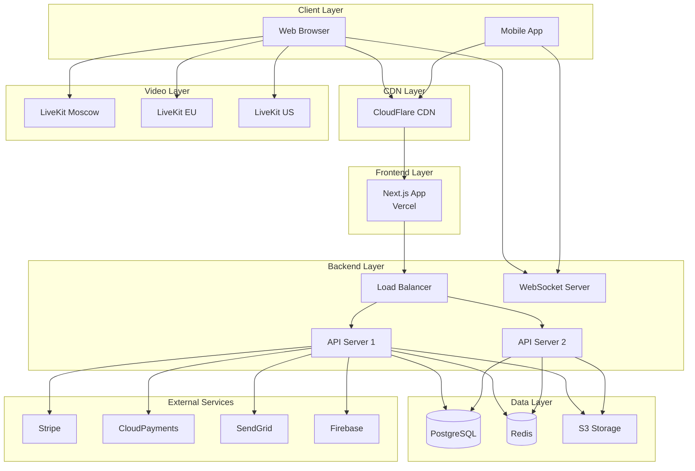

### 2. Поток данных при создании события

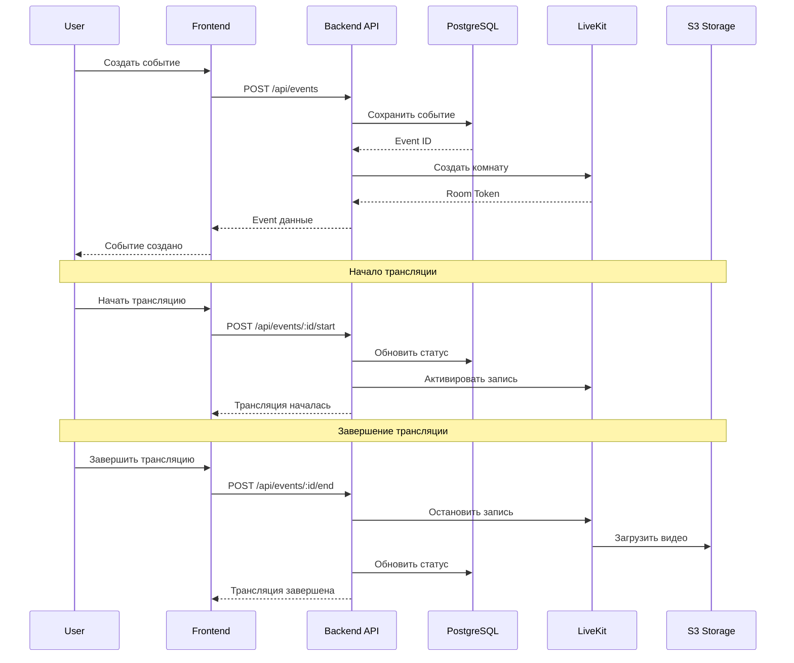

### 3. Процесс оплаты

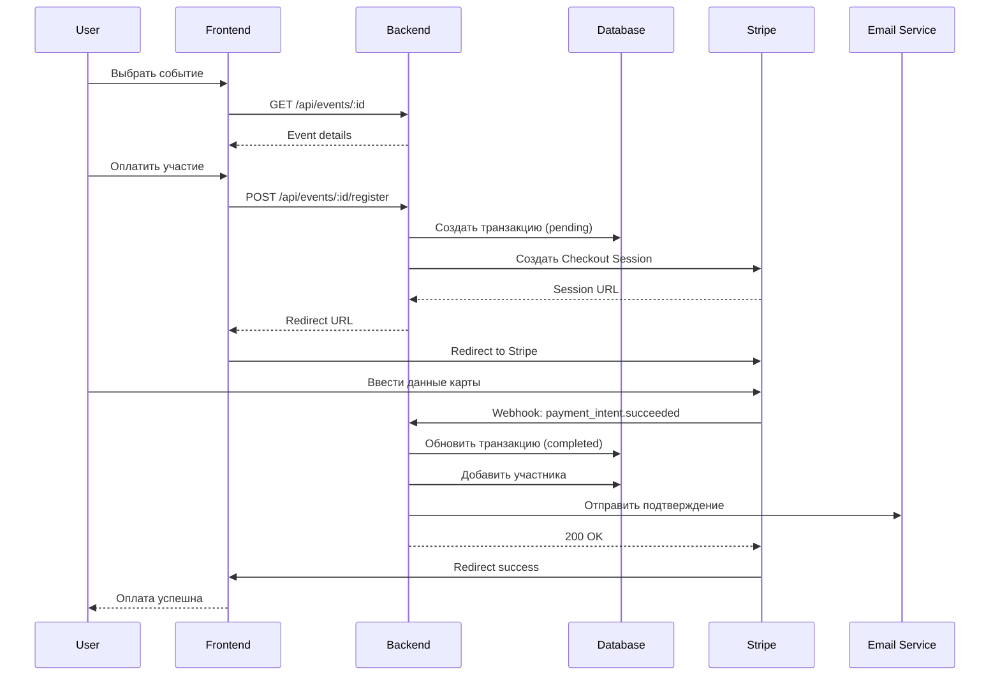

### 4. Real-time чат архитектура

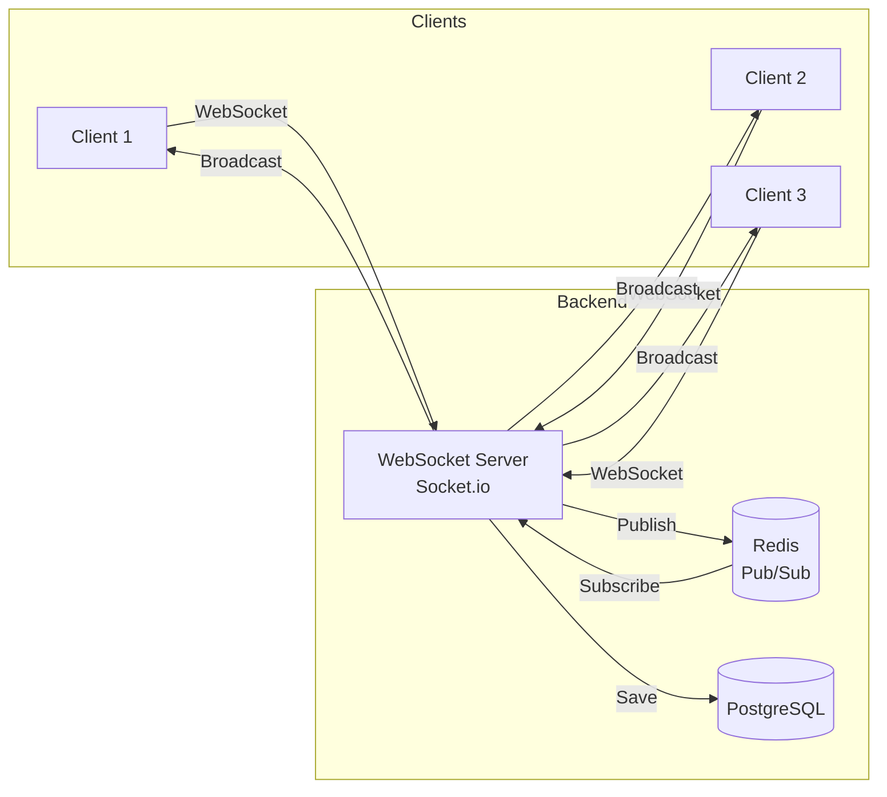

### 5. Система уведомлений

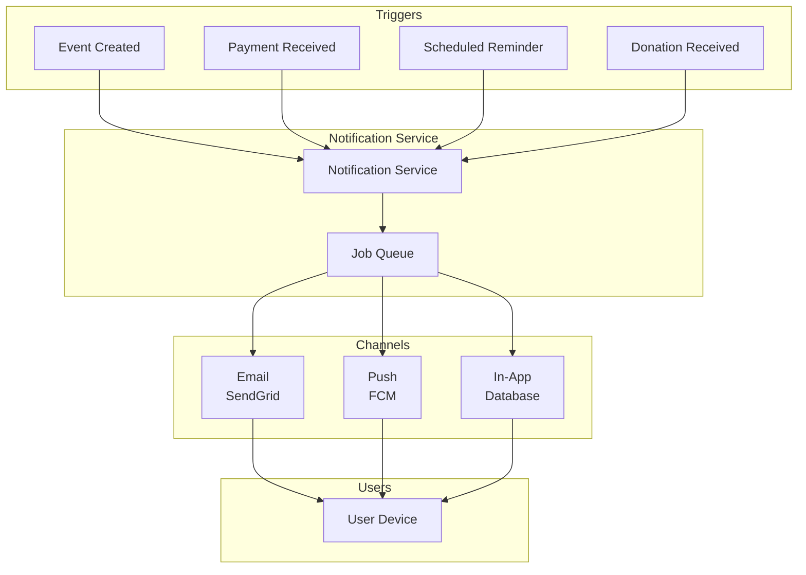

---

## 📊 Модель данных (ER диаграмма)

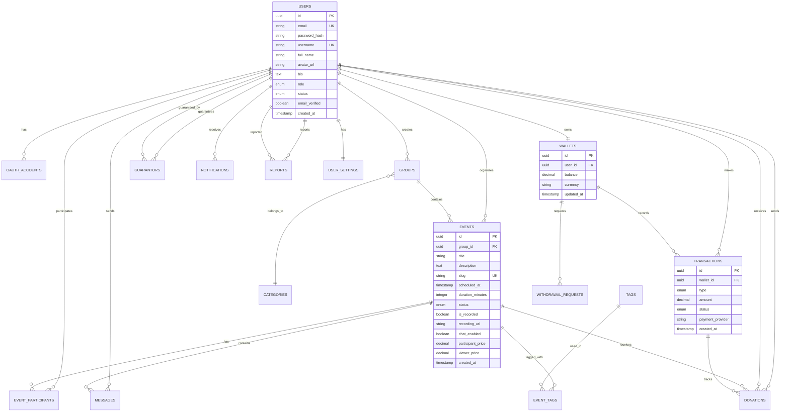

---

## 🔄 Бизнес-процессы

### Процесс становления организатором

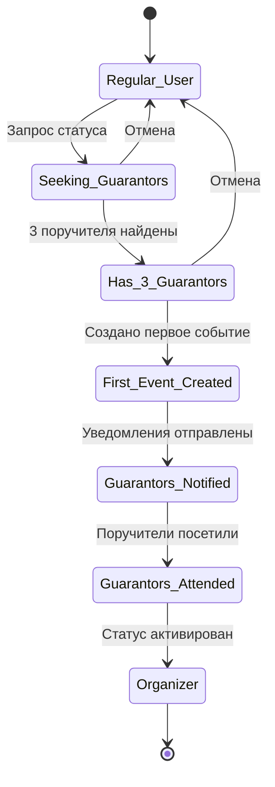

### Жизненный цикл события

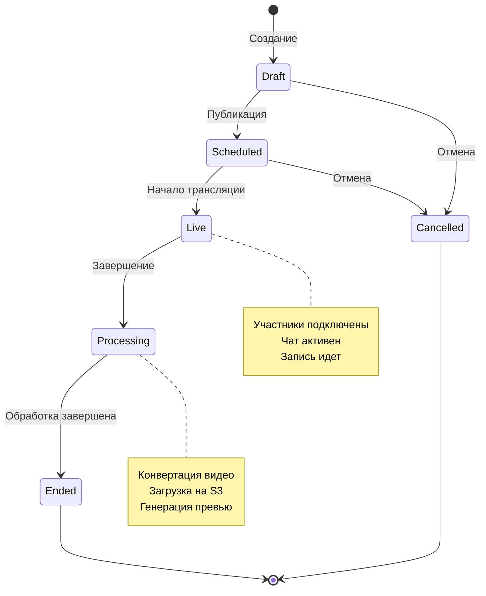

### Процесс вывода средств

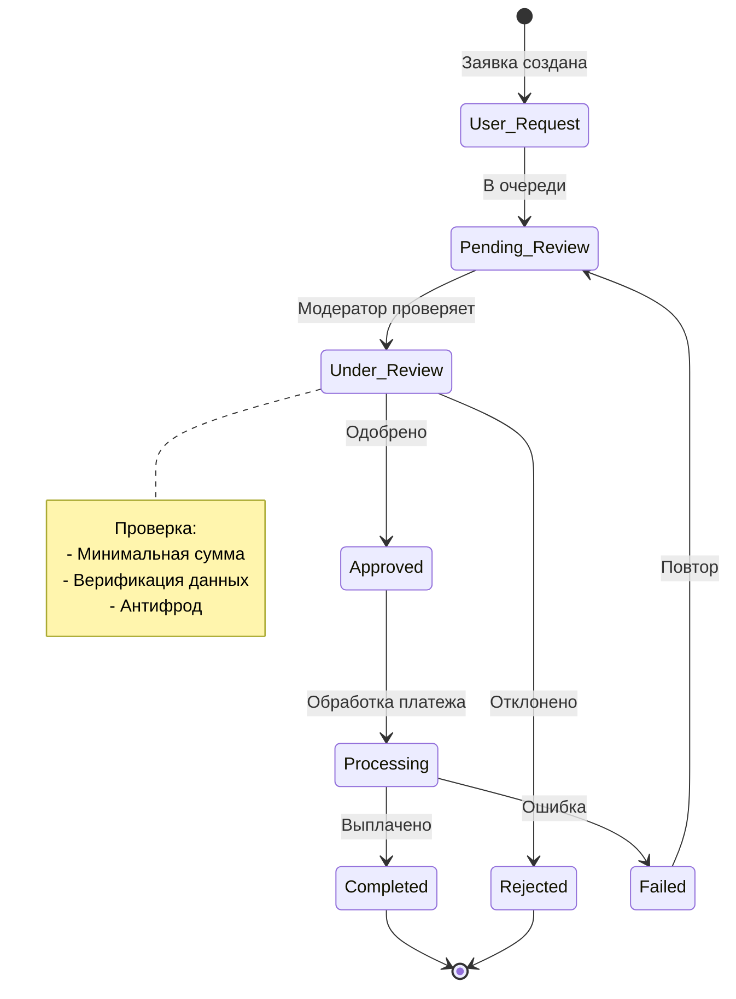

---

## 🎨 UI/UX Flow

### Пользовательский путь: Участие в событии

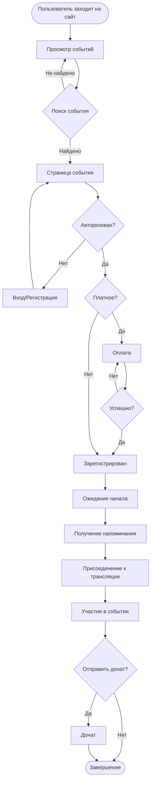

### Организатор: Создание и проведение события

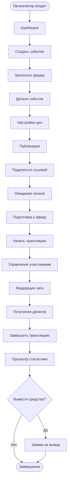

---

## 🔐 Безопасность: Слои защиты

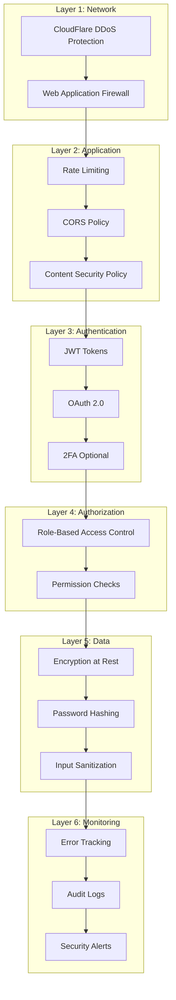

---

## 📈 Масштабирование стратегия

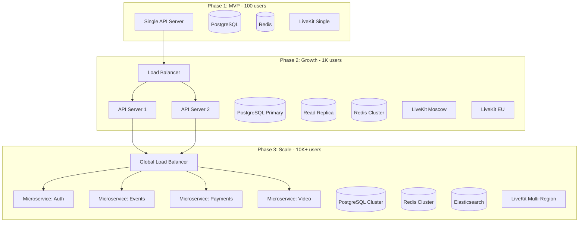

---

## 🎯 Метрики и мониторинг

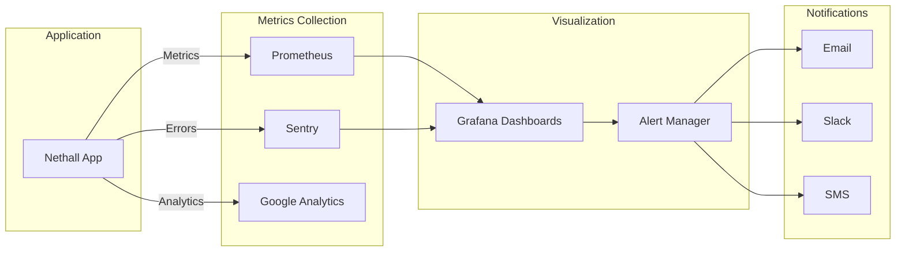

---

**Дата создания**: 24 июля 2026  
**Версия**: 1.0
